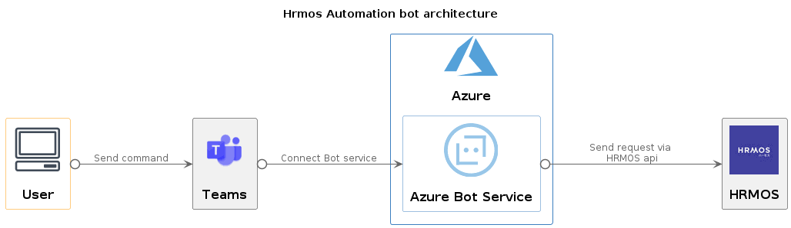
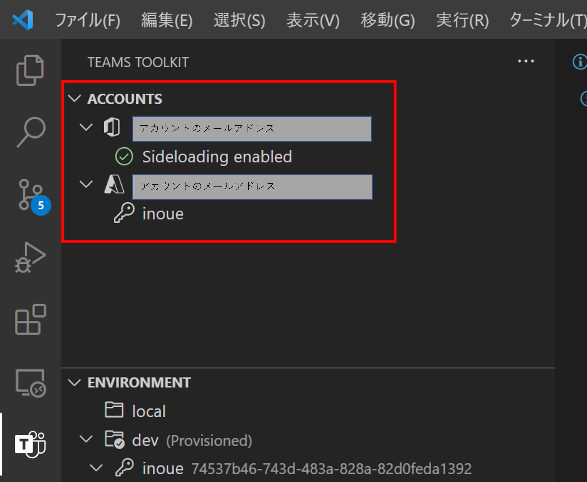
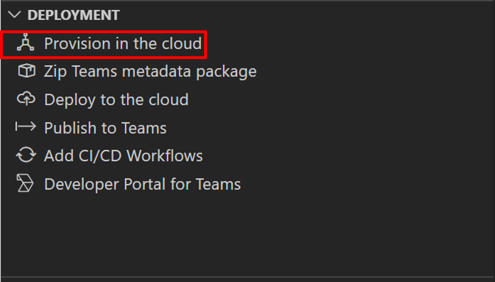
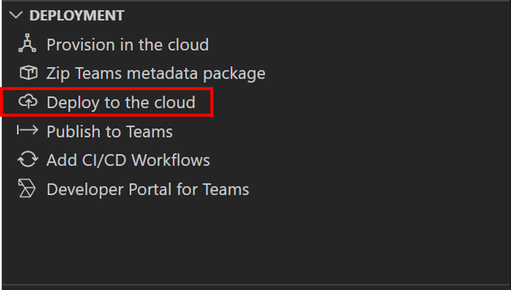

# azure-bot-hrmos
[Hrmos](https://p.ieyasu.co/ULS/login)の勤怠入力を自動化するbotです
TeamsチャットからコマンドでHrmosの打刻が可能になります。

## How to use

botがいるチャットで以下コマンドを使用してHrmosの打刻を行う

- "in"もしくは"おはよう": 出勤を打刻

- "out": 退勤を打刻

- "break": 休憩開始を打刻

- "back": 休憩終了を打刻

## Architecture

[HrmosAPI](https://ieyasu.co/docs/api.html)

## Dev

### PreRequisite

- [Visual Studio Code](https://code.visualstudio.com/)

- [Teams Toolkit](https://docs.microsoft.com/ja-jp/microsoftteams/platform/toolkit/teams-toolkit-fundamentals)

- [nodejs](https://nodejs.org/ja/)

- [Microsoft Account](https://account.microsoft.com/account?lang=en-us)

- [Microsoft 365 Tenant](https://docs.microsoft.com/ja-jp/microsoftteams/platform/concepts/build-and-test/prepare-your-o365-tenant)

### deploy

ローカル、クラウドそれぞれのデプロイ手順を記載する。

#### Local

1. VSCode上でF5キーでデバック開始

2. 自動でブラウザが起動

#### Cloud

Teams Toolkitを使用する

1. 初回のみ
    1. Microsoftアカウントでログイン
    1. サブスクリプションを選択
    
    1. Provision in the cloud でリソースグループの作成
    
    1. Deploy to the cloudを選択
    
1. 2回目以降
    1. Deploy to the cloudを選択

## Licence

[MIT]()

### アイコン

[タイムカード](https://icons8.jp/)

[Microsoft](https://docs.microsoft.com/ja-jp/microsoft-365/solutions/architecture-icons-templates?view=o365-worldwide)